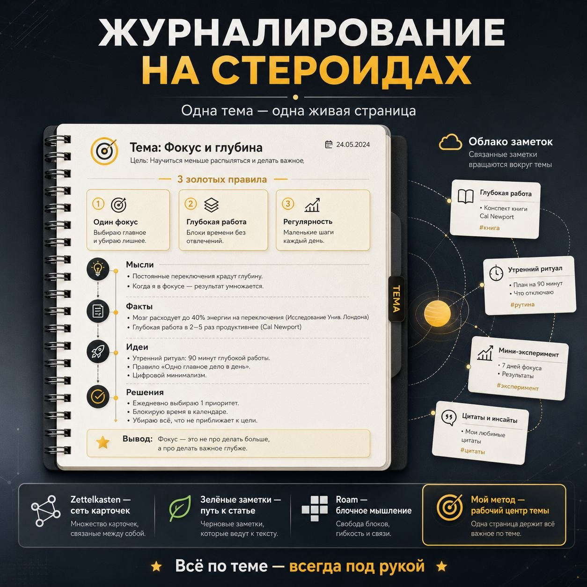

Есть странная проблема: заметки вроде бы сохранены, но нужное знание всё равно приходится искать заново.

Мы записываем мысль в телефон, сохраняем ссылку в браузере, складываем конспект в отдельную папку, обсуждаем решение в чате, а потом пытаемся вспомнить, где именно всё это осталось. Информация не пропала — пропала связь между её частями.

Мой метод журналирования решает эту проблему иначе. Он строится вокруг простого принципа:

> **Одна тема — одна живая страница. Всё важное по теме всегда под рукой.**

Это не обычный дневник и не склад заметок. Это постоянный рабочий центр конкретной темы — место, которое развивается вместе с ней.

## Почему обычное накопление заметок не работает

Обычная система заметок часто начинается правильно: появилась мысль — записали, нашли материал — сохранили, прочитали книгу — сделали конспект.

Проблема появляется позже. Заметки начинают жить отдельными жизнями. Факт лежит в одном месте, вывод — в другом, ссылка на исследование — в третьем, а принятое на их основе решение вообще осталось в переписке.

Через несколько недель человек уже не видит тему. Он видит только набор фрагментов.

Приходится отвечать на вопросы:

- где я это записал;
- почему я тогда сделал такой вывод;
- какие материалы относятся к этой мысли;
- что уже проверено, а что пока только гипотеза;
- на каком решении мы остановились.

Поиск по словам может найти отдельную заметку, но не возвращает целостную картину. А для сложной темы важны не только сами факты. Важны их контекст, последовательность, связи и решения, которые появились по ходу работы.

Именно этого обычно не хватает: **вида сверху**.

## Журнал — это не хроника, а рабочий центр темы

Хронологический дневник отвечает на вопрос: «Что происходило по дням?»

Мой журнал отвечает на другой вопрос: **«Что сейчас происходит с этой темой?»**

Это принципиально разные вещи.

В дневнике записи идут вслед за временем: понедельник, вторник, среда. В тематическом журнале всё собирается вокруг смысла. Неважно, когда появилась заметка. Важно, что она добавляет к пониманию темы, как влияет на решение и с чем связана.

Поэтому журнал можно открыть в любой момент и сразу увидеть состояние темы: её основу, текущие мысли, найденные материалы, нерешённые вопросы и отдельные ветки, которые уже выросли в самостоятельные заметки.

Формула метода выглядит так:

> **Нужна тема → открыл её журнал → всё важное перед глазами.**

Не нужно каждый раз заново собирать контекст. Не нужно вспоминать, где лежат куски работы. Ты возвращаешься не в архив, а в уже развёрнутую рабочую среду.

## Как устроена одна живая страница

### 1. Короткое название

Каждый журнал посвящён чему-то одному. Название должно сразу отвечать на вопрос: «О чём эта страница?»

Например:

- `Продажи`;
- `ИИ`;
- `Бизнес`;
- `Мышление`.

Название не обязано быть красивым или академическим. Его задача — быстро вернуть тебя к нужному центру.

Если тема разрастается настолько, что в названии приходится соединять пять разных направлений, это сигнал: возможно, перед тобой уже несколько тем, а не одна.

### 2. Три золотых правила

В начале страницы находятся три главные идеи, правила или принципа этой темы.

Это не декоративный список. Три правила задают ядро журнала и помогают не потерять направление среди новых фактов и мыслей.

Например, для темы «Фокус» это могут быть:

1. один главный приоритет;
2. глубокая работа без постоянных переключений;
3. регулярные небольшие шаги.

Когда материала становится много, эти три опоры напоминают, что именно является сутью темы, а что — только второстепенной деталью.

### 3. Свободный журнал

После ядра начинается живая часть страницы. Здесь не нужно заранее строить идеальную систему папок и классификаций.

В журнал попадает всё, что развивает тему:

- новая мысль;
- уточнение;
- наблюдение;
- факт;
- решение;
- вопрос и ответ;
- гипотеза;
- идея для эксперимента;
- вывод из прочитанного материала.

Главное правило очень простое:

> **Открыл журнал — дописал туда.**

Не надо сначала думать, к какой категории отнести заметку, как назвать файл и в какую папку его положить. Если информация относится к теме, она сначала появляется в её рабочем центре.

Это снижает трение. А чем меньше лишних действий между мыслью и записью, тем выше шанс, что знание вообще будет сохранено.

### 4. Облако связанных заметок

Внутри журнала есть отдельный блок со ссылками на самостоятельные материалы:

- `[[Исследование]]`;
- `[[Конспект книги]]`;
- `[[Отдельная идея]]`;
- `[[Эксперимент]]`;
- `[[Решение по проекту]]`.

Такие заметки не растворяются в общей странице. Если мысль выросла в полноценную тему, её можно вынести отдельно. Но связь с исходным центром сохраняется.

Так появляется облако заметок вокруг главной темы. Самостоятельные документы продолжают существовать, а журнал остаётся местом, где видна вся конструкция целиком.

## Как появляется вид сверху

Представим тему «Продажи».

Сначала в журнале появляются три главных принципа. Потом добавляются наблюдения из разговоров с клиентами, факты из книг, идеи новых предложений и решения по текущему проекту. Одна мысль превращается в отдельную заметку, другая — в эксперимент, третья отбрасывается как нерабочая.

Если всё это хранить разрозненно, через месяц останется архив материалов. Если вести тематический журнал, через месяц появится траектория:

- с какого вопроса началась работа;
- какие факты изменили первоначальное понимание;
- какие гипотезы проверили;
- какие решения приняли;
- что ещё требует внимания;
- куда тема движется дальше.

Вот что означает «вид сверху». Это не красивый граф и не автоматическая карта связей. Это способность открыть одну страницу и увидеть не отдельную заметку, а **состояние всей темы**.

## Чем метод отличается от других систем

Мой метод не отменяет существующие подходы к работе со знаниями. Он решает другую задачу.

**Zettelkasten** строит сеть из множества небольших самостоятельных заметок. Его сила — в неожиданных связях между карточками. В моём подходе главным является не сеть, а одна постоянная страница-центр конкретной темы.

**Зелёные заметки** помогают развивать мысли до законченного материала. В моём случае сначала можно собрать разрозненные мысли и наблюдения в журнале, а уже потом увидеть структуру и развернуть из неё статью или проект.

**Roam Research** соединяет блочное мышление, вложенность и ссылки между блоками. Но метод не привязан к конкретному приложению. Его центр — не инструмент, а логика: одна тема получает своё постоянное рабочее место.

**MOC, или карта содержания,** обычно собирает ссылки на уже существующие заметки и помогает ориентироваться в базе. Тематический журнал идёт дальше: он содержит не только навигацию, но и живое развитие самой темы.

**Daily Notes и обычное журналирование** фиксируют происходящее по времени. Здесь же в центре находится не хроника дней, а развитие смысла.

Поэтому метод можно использовать рядом с другими системами. Он не обязан заменять архив, ежедневные записи или отдельные заметки. Он нужен как слой, который собирает всё важное вокруг темы и возвращает человеку целостный контекст.

## Где метод особенно полезен

Тематический журнал хорошо работает там, где вопрос нельзя закрыть одной заметкой.

Это могут быть:

- изучение новой области;
- развитие проекта;
- исследование рынка;
- ведение бизнеса;
- работа над статьёй или книгой;
- освоение инструмента;
- личная стратегия;
- наблюдение за привычкой или экспериментом.

Во всех этих случаях тема меняется со временем. В ней появляются новые данные, решения и противоречия. Если каждый раз создавать отдельную заметку, связь быстро теряется. Если возвращать всё в живой журнал, тема остаётся перед глазами и продолжает развиваться.

## Что метод не делает

Журналирование не превращает хаос в порядок автоматически. Оно не заменяет мышление, не избавляет от необходимости проверять факты и не решает за человека, что действительно важно.

Метод требует дисциплины: если тема выделена в отдельный журнал, к ней нужно возвращаться и поддерживать её в живом состоянии. Если записывать всё подряд без отбора, страница превратится в новый хаос.

Он также не заменяет обычный дневник. Дневник нужен, чтобы сохранить хронику жизни и работы. Тематический журнал нужен, чтобы удерживать развитие конкретной идеи, вопроса или проекта.

Это разные инструменты для разных уровней обзора.

## Как начать сегодня

Не нужно переносить всю базу заметок и строить идеальную систему.

Выбери одну тему, которая сейчас действительно важна. Создай страницу с её коротким названием. Добавь три главных правила или идеи. Затем перенеси туда текущие мысли, факты, решения и ссылки на уже существующие материалы.

После этого возвращайся к странице каждый раз, когда появляется что-то новое по теме.

Через некоторое время ты увидишь разницу. Раньше у тебя были отдельные заметки о теме. Теперь у тебя есть **сама тема — в рабочем состоянии**.

## Главное

Журналирование на стероидах — это способ не просто сохранять знания, а постоянно держать тему в поле зрения.

Одна страница становится её центром. В начале — три главные опоры. Дальше — свободное развитие мыслей, фактов, решений и наблюдений. Вокруг — облако самостоятельных заметок, которые продолжают общую линию.

Так знания перестают быть складом, куда заглядывают только во время поиска. Они становятся рабочей средой, которая растёт вместе с тобой.

> **Одна тема — одна живая страница. Всё по теме — всегда под рукой.**

## Теги

#журналирование #знания #заметки #продуктивность #PKM #системаЗаметок
